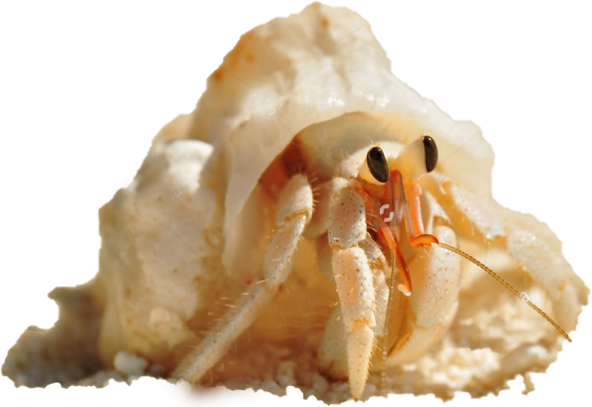

<!-- Random Location Hermit 
            
 
                
            

                 
            -->

            

Scroll up... 

/* ------------------------------------------------------------------- Option 1 random location hermit 

div {
    float: left;
}

#hermit {
    background-image: url("../../assets/images/hermit.png");
}

#page_Wrapper {   

}

button.hermit { 
            background: url("../../assets/images/hermit.png"); 
            background-size: cover; 
            font-size: 2rem; 
            color: #c2b280;
            margin: none;
            border: none;
            outline: none;
            width: 50px;
            position: absolute;
        } 
*/

function foundHermit(){
    document.getElementById("myBtn").innerHTML = "Found Him!";
}

function foundMessage(){
    setTimeout(function(){ alert("Are you ready for the next challenge?"); }, 2000);
}

function gone(){
  $("button.hermit").hide();
  };

var btn = document.getElementById("myBtn");

 //btn.addEventListener("click", foundHermit);
 btn.addEventListener("click", foundMessage);
 btn.addEventListener("click", gone);

 
/*

var button = document.getElementById("clickme"),
  count = 0;
button.onclick = function() {
  count += 1;
  button.innerHTML = "Click me: " + count;
};

 

 $(document).ready(function(){
  $("button").click(function(){
    $("#test").hide();
  });
});
*/

var herm = document.getElementById("herm"),
    score = 0;
    herm.onclick = function() {
    score += 1;
    counter.innerHTML = "You found him "+ score + "times";
};
var localStorageName = "hiddenHerm";
var highScore;

highScore = localStorage.getItem(hiddenHerm) == null ? 0:
            localStorage.getItem(hiddenHerm);

if (localStorage.getItem("hiddenHerm") == null) {
    highScore = 0;
} else {
    highScore = localStorage.getItem(hiddenHerm);
}

function() {
    hightScore = Math.max(score,hightScore);
    localStorage.setItem(hiddenHerm, highScore);

    var style = {
        font: "32px Monospace",
        fill: "#00ff00",
        align: "center"
    }
}
var text = game.add.text(
    game.width / 3, game.height / 3, "You gave up? \n You found him " + score + "times \n Your best score is" + highScore + "found", style);

    text.anchore.set(0.5);
    game.input.onDown.add(this.restartGame, this);
)